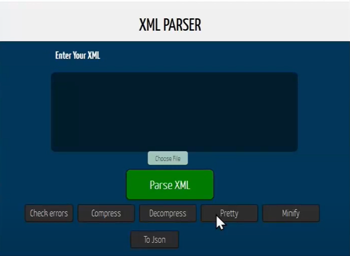
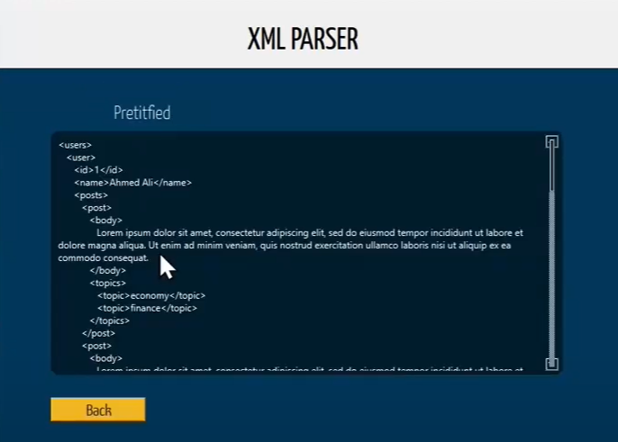
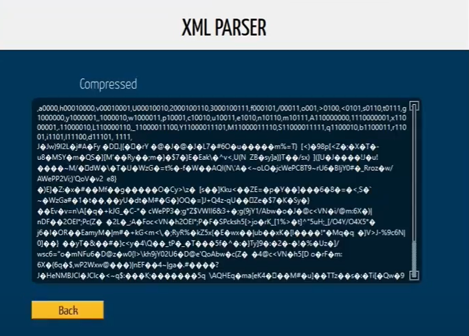
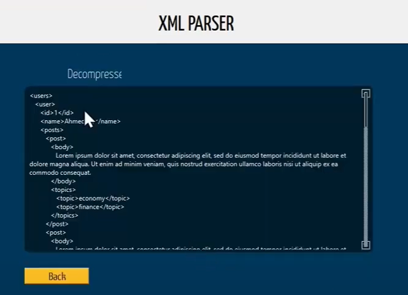

# Data-Structures-and-Algorithms-Project
## Project Discription
Our project consists of:
-	Reading an XML file and be able to detect and correct syntax errors.
-	Prettifying the XML file.
-	Converting the XML file to JSON.
-	Minifying the XML file.
-	Compressing the data in the XML file.

In our system the XML file will represent users in a social network Each user has id (unique), name, list of posts, list of followers. Each post has text and list of topics.
-	representing the user’s data using the graph data structure.
-	Network analysis.
-	Post Search.
-	Graph visualization.
All these functionalities should be accessed from a GUI
## Project Map
"XML Reader Codes" folder incudes:
-	XMLNode class header and c++ codes (it represents the nodes of the tree)
-	XMLDocument class header and c++ codes (contains the function for loading, minimizing, error correction and detection, writing, converting to JSON, and converting to graph).
-	Graph class header and c++ codes (contains the XML graph and network analysis functions) Note: most famous user function exists in XMLDocument class.

"Compression" folder includes:
-	Codes regarding compression and decompression.

"GUI" folder includes:
-	Codes regarding GUI.

## Algorithm

You can write an XML code in the text area shown or you can load an XML file by pressing on choose file button.

# functionalities
- Parse XML

By clicking on this button XMLDocument_parse("file path") is called this method checks balance and errors and extracts the data from XML file to a tree structure. This method uses checkBalance(std::string, int) as a helper method for checking the XML balance.
- Compress

With pressing the compress button, we pass the xml data to compression function, getting the unique data and frequency, use the Huffman code algorithm to make the codes of unique data, encode the xml data to zeroes and ones, and compress those zeroes and ones by tacking every 7 bits and convert them into character data type. Finally put the unique data and their codes in the first line, then put the encoded data as char in the next line.
- Decompress

With pressing the decompress button, the first line is the data codes and the unique data (as explained), so we insert them to a binary tree, then get the next line, which is the encoded data, convert it into binary, then traverse this binary code by the binary tree to decode it into xml data.
- Prettify

By pressing this button XMLDocument_write method is invoked which accordingly calls Format method which iterates recursively over each parent node and through a loop goes over each child and prints it with proper indentation and through each recursion it increases the indentation depending on the depth of nesting, we also added that if a tag inner text exceeds 200 characters its printed in a new line to improve readability.
- Minify

By pressing this button XMLDocument_write method is invoked which accordingly calls Minify method which Goes in the same way as format, but it prints everything in one line with no indentation.
- To Json

By pressing this button XMLDocument_write method is invoked which accordingly calls JSON method.
Due to differences between xml files and Json, we marked each node if it had children with the same tag, it only prints the tag one time and add the inner texts to an array, the indentation is similar to the format option.
- Post Search

It simply takes a word or sub string as an argument and searches in the whole posts in the network to get a post containing this word or a topic speaking about this word and returns a vector containing all posts related. 
# Graph

The graph is constructed by invoking constructGraph method located in XMLDocument class which creates a graph object with number of vertices equal to number of users and start filling up the adjacency matrix depending on follower dependencies between users, finally convert the adjacency matrix into a visualized graph representing the relationships between users.

With the graph visualized in the screen we also show some statistics like most active user, and most influencer user.

- mutual followers between two users:

taking two users id as parameters and returns the mutual users id.
- suggest a list of users to follow:

for a given user it iterates for his followers and search for a follower that is not a follower of the given node and returns a vector of suggested followers.

## Snapshots

  

  

  

  

  

  

